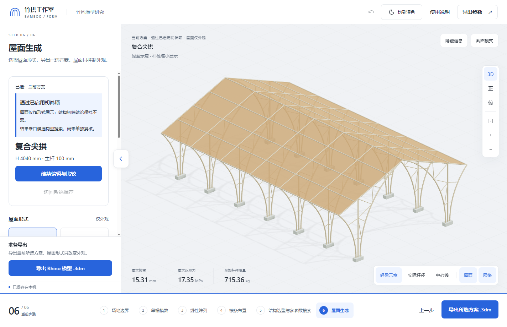

# 竹拱工作室 · 前端

原竹拱结构设计工作台的界面、三维预览与 Windows 桌面程序。基于当前 0.8.0 整理，保留屋面显示增强、方案编辑与应力对比，以及最新阶段名称。

配套仓库名称：`bamboo-studio-backend`。两个仓库独立构建，通过本机接口通信，不需要嵌套目录或 Git submodule。



## 包含哪些功能

1. 场地边界
2. 单榀模数
3. 线性阵列
4. 檩条布置
5. 结构选型与多参数搜索
6. 屋面生成

用户可选择推荐方案或其他构型，继续修改参数，并比较修改前后的应力云图。未通过初筛的方案仍可生成屋面，界面保留其计算状态。第六步的屋面控制外观，不重新定义结构计算中的荷载面。

## 前后端如何分工

```text
本仓库                                       后端仓库
HTML/CSS + Three.js
       ↓ WebView2 消息
Windows 桌面宿主 / KarambaClient  ──HTTP──→  Rhino 插件 / Jobs
       ↓                                      ↓
Rhino3dm 导出、截图保存                     Karamba3D 求解
```

这里的“前端”包括 Windows 桌面宿主。浏览器界面通过宿主访问本机 Rhino；本仓库不是一个可以直接发布到 GitHub Pages 的纯网页应用。`ui/core.js` 负责几何预览，不执行有限元计算。正式计算只使用后端 Karamba3D。

## 从源码构建

构建环境：Windows x64、Node.js 20 或以上、.NET 9 SDK。项目目标框架仍为 `net8.0-windows`，`global.json` 选择 9.0 系列 SDK。本次验证使用 Node 24.19.0、npm 11.17.0 和 SDK 9.0.316。

1. 下载或克隆本仓库，解压到有写权限的文件夹。
2. 在仓库根目录打开 PowerShell。
3. 检查工具：

   ```powershell
   node --version
   npm.cmd --version
   dotnet --list-sdks
   ```

4. 执行：

   ```powershell
   powershell -NoProfile -ExecutionPolicy Bypass -File .\Build.ps1
   ```

   脚本依次执行 `npm ci`、回归测试、界面打包、锁定 NuGet 依赖还原及桌面发布。首次构建需下载 npm/NuGet 依赖。

5. 启动 `artifacts/desktop/BambooStudio.exe`。分发时保留整个 `artifacts/desktop` 文件夹；不能只复制 EXE。

运行界面需要 Microsoft Edge WebView2 Runtime。发布目录自带 .NET 运行库；用户不需要为运行 EXE 安装 SDK。真实计算另外需要后端的 Rhino 8、Grasshopper 和可用的 Karamba3D 许可。

如只修改网页资源，可执行：

```powershell
npm.cmd ci
npm.cmd run build:ui
```

生成的 `ui/index.html` 会嵌入桌面程序；仅生成 HTML 不会更新已发布的 EXE，需要继续运行 `Build.ps1`。

## 连接后端

1. 按后端仓库 README 构建并加载 `BambooKarambaBridge.rhp`。
2. 保持 Rhino 打开，运行 `Grasshopper`，确认 Karamba3D 已加载。
3. 在 Rhino 命令栏运行 `BambooKarambaStart`。
4. 打开本 App，在第五步点击重新连接。
5. 先用演示预设运行一次，再按研究条件修改参数。

端口与临时令牌由插件写入 `%LOCALAPPDATA%\BambooStudio\KarambaBridge\connection.json`；App 自动读取。不需要手填端口，也不要把这个文件上传 GitHub。接口细节见 [API.md](docs/API.md)。

## 目录与修改入口

| 路径 | 用途 |
|---|---|
| `ui/app.js` | 页面流程、阶段文案、事件绑定 |
| `ui/renderer.js`、`ui/core.js` | 三维渲染与几何预览 |
| `ui/roof-style.mjs` | 屋面显示样式 |
| `ui/scheme-editor*.mjs` | 方案编辑、选择及前后对照 |
| `ui/search-space.mjs` | 候选范围与搜索数量展示 |
| `ui/screening.mjs`、`ui/result-status.mjs` | 初筛依据与结果状态显示 |
| `ui/client.mjs` | 界面请求与任务轮询 |
| `desktop/KarambaClient.cs` | 本机后端发现及认证请求 |
| `desktop/DesktopHost.cs` | WebView2 宿主与界面消息转发 |
| `desktop/RhinoExport.cs`、`ui/rhino-export.mjs` | `.3dm` 导出 |
| `build-ui.mjs` | 把 CSS、几何核心和前端模块打包为 HTML |
| `tests/` | 单元测试、记录回放与桌面冒烟测试 |
| `licenses/` | 第三方许可原文 |

现有内部构型 ID 与存储键保留兼容性；界面文案不限定构型数量。扩展构型需要同时修改后端注册与搜索逻辑，不能只加一个前端选项。详见 [开发交接](docs/DEVELOPMENT.md)。

## 验证

```powershell
npm.cmd test
powershell -NoProfile -ExecutionPolicy Bypass -File .\Test-Desktop.ps1
```

第二条需先构建 EXE 和安装 WebView2，会短暂打开测试窗口，检查完自动关闭。它使用独立用户目录和已有 Karamba3D 结果回放，不连接实际 Rhino，不改变正式 App 的草稿。截图和报告在 `artifacts/ui-test/`。

回放成功不表示当前机器已通过真实结构计算。新机器的联调验收需实际运行 Rhino 与 Karamba3D。

## 上传 GitHub

见 [上传步骤](docs/UPLOAD.md)。应上传源码、锁文件与 README；`node_modules`、`bin`、`obj`、生成的 HTML 和 EXE 发布目录已被忽略。供他人下载安装的整包可单独作为 Release 附件。

项目自身许可证尚未指定，见 [RIGHTS.md](RIGHTS.md)。
